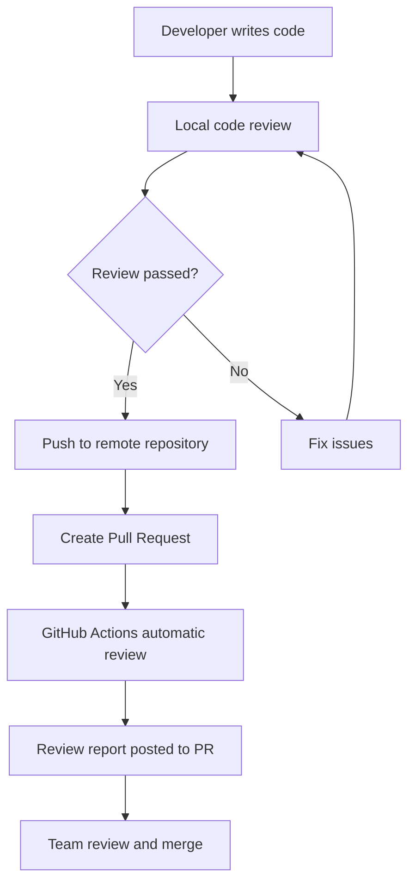

# 🤖 AI Code Review Workflow Guide

This guide provides detailed instructions on how to use the AI Code Review Bot's complete workflow, including local review and remote automatic review.

## 📋 Workflow Overview



## 🔧 本地代码审查流程

### 1. 准备工作

```bash
# 确保在项目根目录
cd your-project

# 安装依赖
pip install -r .github/code-review/requirements.txt

# 设置环境变量
export GOOGLE_API_KEY="your_google_ai_api_key_here"
```

### 2. 运行本地审查

```bash
# 基本用法：比较当前分支与 main 分支
python .github/code-review/local_review.py main

# 指定输出文件
python .github/code-review/local_review.py main --output my_review.md

# 指定当前分支
python .github/code-review/local_review.py main --current-branch feature/new-feature

# JSON 格式输出
python .github/code-review/local_review.py main --format json --output review.json
```

### 3. 审查报告示例

本地审查会生成详细的 Markdown 报告：

```markdown
# Code Review Report

**Generated**: 2024-01-15T10:30:00
**Branch Comparison**: main → feature/auth
**Files Changed**: 5
**Additions**: 120
**Deletions**: 15

## 📁 Changed Files
- src/auth/login.py
- src/auth/register.py
- tests/test_auth.py
- config/auth.json
- README.md

## 🔍 Detailed Review

## 🔒 Security Review Summary
Overall security assessment: 发现 1 个潜在安全问题

## 🚨 Critical Issues
- **File**: src/auth/login.py
  - **Line**: 25
  - **Issue**: 硬编码的 JWT 密钥
  - **Risk**: 可能导致安全漏洞
  - **Fix**: 使用环境变量存储密钥

## 💡 Recommendations
- 实施输入验证
- 使用 HTTPS 进行所有通信
- 添加日志记录
```

## 🚀 远程自动审查流程

### 1. GitHub Actions 配置

当您创建 Pull Request 时，GitHub Actions 会自动触发：

```yaml
# .github/workflows/ai-code-review.yml
on:
  pull_request:
    types: [opened, synchronize, reopened, ready_for_review]
```

### 2. 自动审查触发条件

- ✅ 新的 Pull Request 创建
- ✅ Pull Request 更新（新提交）
- ✅ Pull Request 重新打开
- ✅ Pull Request 标记为准备审查
- ✅ 手动触发（通过 GitHub Actions 界面）

### 3. 审查结果

自动审查会在 PR 中发布评论：

```
🤖 AI Code Review Results

## 🔍 Code Review Summary
Overall assessment: 发现 2 个需要关注的问题

## 🚨 Critical Issues
- **File**: src/auth/login.py:25
  - **Issue**: 硬编码的 JWT 密钥
  - **Risk**: 安全漏洞
  - **Fix**: 使用环境变量

## ⚠️ Warnings
- **File**: src/auth/register.py:42
  - **Issue**: 缺少输入验证
  - **Suggestion**: 添加参数验证

## 💡 Recommendations
- 实施输入验证
- 使用环境变量存储敏感信息
- 添加单元测试
```

## 📊 最佳实践工作流程

### 开发阶段

1. **编写代码**
   ```bash
   git checkout -b feature/new-feature
   # 编写代码...
   ```

2. **本地审查**
   ```bash
   python .github/code-review/local_review.py main
   ```

3. **修复问题**
   ```bash
   # 根据审查报告修复问题
   # 重新审查
   python .github/code-review/local_review.py main
   ```

4. **提交代码**
   ```bash
   git add .
   git commit -m "feat: add new feature with security improvements"
   git push origin feature/new-feature
   ```

### PR 阶段

1. **创建 Pull Request**
   - GitHub Actions 自动触发审查
   - 机器人发布审查报告

2. **团队审查**
   - 查看 AI 审查报告
   - 人工审查补充
   - 讨论和反馈

3. **修复和更新**
   - 根据反馈修复问题
   - 推送新提交
   - 自动重新审查

4. **合并**
   - 审查通过后合并
   - 删除功能分支

## ⚙️ 配置选项

### 本地审查配置

```json
{
  "ai_settings": {
    "model": "models/gemini-2.5-pro",
    "temperature": 0.1,
    "max_tokens": 2000
  },
  "review_settings": {
    "max_files_per_review": 50,
    "max_lines_per_file": 1000,
    "skip_files": ["*.min.js", "*.min.css", "*.lock"],
    "focus_languages": ["python", "javascript", "typescript"]
  }
}
```

### GitHub Actions 配置

在仓库设置中添加 Secrets：
- `GOOGLE_API_KEY`: Google AI API 密钥
- `GITHUB_TOKEN`: 自动提供

## 🔍 审查类型详解

### 1. 安全审查
- 硬编码密钥检测
- SQL 注入漏洞
- XSS 攻击防护
- 输入验证
- 认证授权

### 2. 性能审查
- 算法复杂度
- 内存使用
- 数据库查询优化
- 网络操作
- 缓存策略

### 3. 代码质量审查
- 代码结构
- 可读性
- 可维护性
- 错误处理
- 测试覆盖率

### 4. 最佳实践审查
- 语言特定规范
- 设计模式
- 编码标准
- 技术债务

## 🚨 故障排除

### 常见问题

1. **API 密钥错误**
   ```
   Error: GOOGLE_API_KEY environment variable not set
   ```
   **解决方案**: 设置正确的 API 密钥

2. **Git 仓库错误**
   ```
   Error: Not in a git repository
   ```
   **解决方案**: 确保在 Git 仓库根目录运行

3. **分支不存在**
   ```
   Error: branch 'main' does not exist
   ```
   **解决方案**: 检查分支名称，使用 `git branch` 查看可用分支

4. **权限错误**
   ```
   Error: 403 Forbidden
   ```
   **解决方案**: 检查 GitHub token 权限

### 调试模式

```bash
# 启用详细日志
export DEBUG=true
python .github/code-review/local_review.py main
```

## 📈 性能优化

### 1. 文件过滤
- 跳过生成文件（*.min.js, *.min.css）
- 跳过锁文件（package-lock.json, yarn.lock）
- 专注于特定语言

### 2. 批量处理
- 大型 PR 自动分批处理
- 避免 API 限制
- 并行分析多个文件

### 3. 缓存机制
- 缓存已分析的文件
- 增量分析
- 提高响应速度

## 🎯 团队协作

### 1. 代码审查标准
- 定义审查标准
- 设置质量门槛
- 培训团队成员

### 2. 审查流程
- 本地审查 → PR 创建 → 自动审查 → 人工审查 → 合并
- 明确责任分工
- 建立反馈机制

### 3. 持续改进
- 收集反馈
- 优化规则
- 更新配置

## 📚 相关资源

- [代码审查最佳实践](https://github.com/microsoft/vscode/wiki/Code-Review-Guidelines)
- [GitHub Actions 文档](https://docs.github.com/en/actions)
- [Google AI API 文档](https://ai.google.dev/docs)

---

**提示**: 这个工作流程结合了本地审查的灵活性和远程自动审查的便利性，为团队提供了完整的代码质量控制解决方案。
