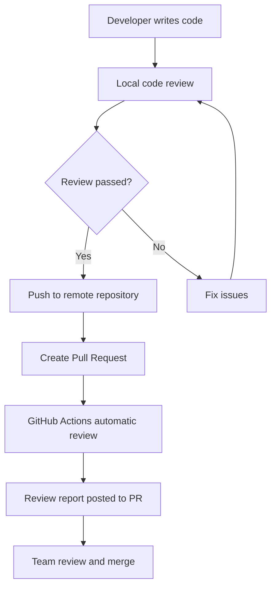

# 🤖 AI Code Review Workflow Guide

This guide provides detailed instructions on how to use the AI Code Review Bot's complete workflow, including local review and remote automatic review.

## 📋 Workflow Overview



## 🔧 Local Code Review Process

### 1. Prerequisites

```bash
# Ensure you're in the project root directory
cd your-project

# Install dependencies
pip install -r .github/code-review/requirements.txt

# Set environment variables
export GOOGLE_API_KEY="your_google_ai_api_key_here"
```

### 2. Run Local Review

```bash
# Basic usage: compare current branch with main branch (includes all changes by default)
# This includes: committed changes, staged changes, working directory changes, and untracked files
python .github/code-review/local_review.py main

# Specify output file
python .github/code-review/local_review.py main --output my_review.md

# Specify current branch
python .github/code-review/local_review.py main --current-branch feature/new-feature

# JSON format output
python .github/code-review/local_review.py main --format json --output review.json

# Only review committed changes (excludes uncommitted and untracked files)
python .github/code-review/local_review.py main --committed-only

# Explicitly include all uncommitted changes (default behavior)
python .github/code-review/local_review.py main --include-uncommitted
```

### 3. Review Report Example

Local review generates detailed Markdown reports:

```markdown
# Code Review Report

**Generated**: 2024-01-15T10:30:00
**Branch Comparison**: main → feature/auth
**Files Changed**: 5
**Additions**: 120
**Deletions**: 15

## 📁 Changed Files
- src/auth/login.py
- src/auth/register.py
- tests/test_auth.py
- config/auth.json
- README.md

## 🔍 Detailed Review

## 🔒 Security Review Summary
Overall security assessment: Found 1 potential security issue

## 🚨 Critical Issues
- **File**: src/auth/login.py
  - **Line**: 25
  - **Issue**: Hardcoded JWT secret key
  - **Risk**: May lead to security vulnerabilities
  - **Fix**: Use environment variables to store the key

## 💡 Recommendations
- Implement input validation
- Use HTTPS for all communications
- Add logging
```

## 🚀 Remote Automatic Review Process

### 1. GitHub Actions Configuration

When you create a Pull Request, GitHub Actions automatically triggers:

```yaml
# .github/workflows/ai-code-review.yml
on:
  pull_request:
    types: [opened, synchronize, reopened, ready_for_review]
```

### 2. Automatic Review Trigger Conditions

- ✅ New Pull Request created
- ✅ Pull Request updated (new commits)
- ✅ Pull Request reopened
- ✅ Pull Request marked as ready for review
- ✅ Manual trigger (via GitHub Actions interface)

### 3. Review Results

Automatic review posts comments in the PR:

```
🤖 AI Code Review Results

## 🔍 Code Review Summary
Overall assessment: Found 2 issues that need attention

## 🚨 Critical Issues
- **File**: src/auth/login.py:25
  - **Issue**: Hardcoded JWT secret key
  - **Risk**: Security vulnerability
  - **Fix**: Use environment variables

## ⚠️ Warnings
- **File**: src/auth/register.py:42
  - **Issue**: Missing input validation
  - **Suggestion**: Add parameter validation

## 💡 Recommendations
- Implement input validation
- Use environment variables for sensitive information
- Add unit tests
```

## 📊 Best Practice Workflow

### Development Phase

1. **Write Code**
   ```bash
   git checkout -b feature/new-feature
   # Write code...
   ```

2. **Local Review**
   ```bash
   python .github/code-review/local_review.py main
   ```

3. **Fix Issues**
   ```bash
   # Fix issues based on review report
   # Re-run review
   python .github/code-review/local_review.py main
   ```

4. **Commit Code**
   ```bash
   git add .
   git commit -m "feat: add new feature with security improvements"
   git push origin feature/new-feature
   ```

### PR Phase

1. **Create Pull Request**
   - GitHub Actions automatically triggers review
   - Bot posts review report

2. **Team Review**
   - Review AI review report
   - Human review supplement
   - Discussion and feedback

3. **Fix and Update**
   - Fix issues based on feedback
   - Push new commits
   - Automatic re-review

4. **Merge**
   - Merge after review approval
   - Delete feature branch

## ⚙️ Configuration Options

### Local Review Configuration

```json
{
  "ai_settings": {
    "model": "models/gemini-2.5-pro",
    "temperature": 0.1,
    "max_tokens": 2000
  },
  "review_settings": {
    "max_files_per_review": 50,
    "max_lines_per_file": 1000,
    "skip_files": ["*.min.js", "*.min.css", "*.lock"],
    "focus_languages": ["python", "javascript", "typescript"]
  }
}
```

### GitHub Actions Configuration

Add Secrets in repository settings:
- `GOOGLE_API_KEY`: Google AI API key
- `GITHUB_TOKEN`: Automatically provided

## 🔍 Review Types Explained

### 1. Security Review
- Hardcoded key detection
- SQL injection vulnerabilities
- XSS attack protection
- Input validation
- Authentication and authorization

### 2. Performance Review
- Algorithm complexity
- Memory usage
- Database query optimization
- Network operations
- Caching strategies

### 3. Code Quality Review
- Code structure
- Readability
- Maintainability
- Error handling
- Test coverage

### 4. Best Practices Review
- Language-specific standards
- Design patterns
- Coding standards
- Technical debt

## 🚨 Troubleshooting

### Common Issues

1. **API Key Error**
   ```
   Error: GOOGLE_API_KEY environment variable not set
   ```
   **Solution**: Set the correct API key

2. **Git Repository Error**
   ```
   Error: Not in a git repository
   ```
   **Solution**: Ensure you're running from the Git repository root

3. **Branch Not Found**
   ```
   Error: branch 'main' does not exist
   ```
   **Solution**: Check branch name or create the branch first

4. **Permission Error**
   ```
   Error: 403 Forbidden
   ```
   **Solution**: Check GitHub token permissions

### Debug Mode

```bash
# Enable verbose logging
export DEBUG=true
python .github/code-review/local_review.py main
```

## 📈 Performance Optimization

### 1. File Filtering
- Skip generated files (*.min.js, *.min.css)
- Skip lock files (package-lock.json, yarn.lock)
- Focus on specific languages

### 2. Batch Processing
- Large PRs automatically processed in batches
- Avoid API limits
- Parallel analysis of multiple files

### 3. Caching Mechanism
- Cache analyzed files
- Incremental analysis
- Improve response speed

## 🎯 Team Collaboration

### 1. Code Review Standards
- Define review standards
- Set quality thresholds
- Train team members

### 2. Review Process
- Local review → PR creation → Automatic review → Human review → Merge
- Clear responsibility division
- Establish feedback mechanisms

### 3. Continuous Improvement
- Collect feedback
- Optimize rules
- Update configuration

## 📚 Related Resources

- [Code Review Best Practices](https://github.com/microsoft/vscode/wiki/Code-Review-Guidelines)
- [GitHub Actions Documentation](https://docs.github.com/en/actions)
- [Google AI API Documentation](https://ai.google.dev/docs)

---

**Tip**: This workflow combines the flexibility of local review with the convenience of remote automatic review, providing teams with a complete code quality control solution.
